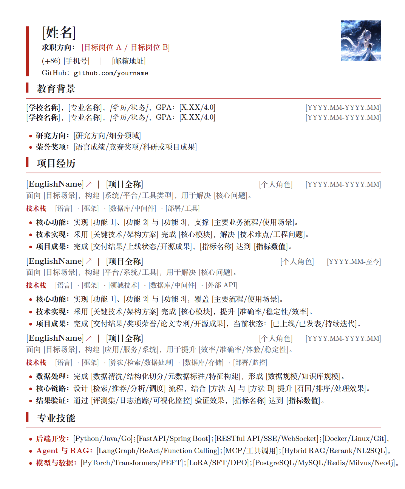

# 中文技术简历模板

适用于 Overleaf / XeLaTeX 的中文技术简历 LaTeX 模板，适合后端开发、Agent 开发、算法工程、数据工程等技术方向。

## 预览



## 特点

- 单文件模板，主要内容集中在 `resume.tex`
- 使用 `ctexart`，适配 Overleaf 中文编译环境
- 不依赖自定义 `resume.cls`
- 不依赖 Adobe 中文字体
- 支持头像占位，可选上传 `images/you.jpg` 或 `images/you.png`
- 包含教育背景、项目经历、专业技能等常用模块

## 使用方法

1. 在 Overleaf 新建空白项目。
2. 上传或粘贴 `resume.tex`。
3. 在 Menu 中将 Compiler 设置为 `XeLaTeX`。
4. 替换方括号中的占位内容，例如 `[姓名]`、`[项目全称]`、`[指标数值]`。
5. 如需头像，新建 `images/` 目录并上传 `you.jpg` 或 `you.png`。
6. 重新编译并导出 PDF。

## 文件结构

```text
.
├── resume.tex
├── preview.png
├── README.md
├── LICENSE
└── .gitignore
```

## License

MIT License
